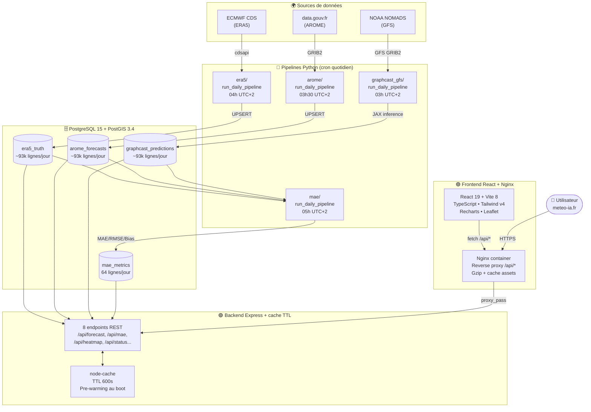
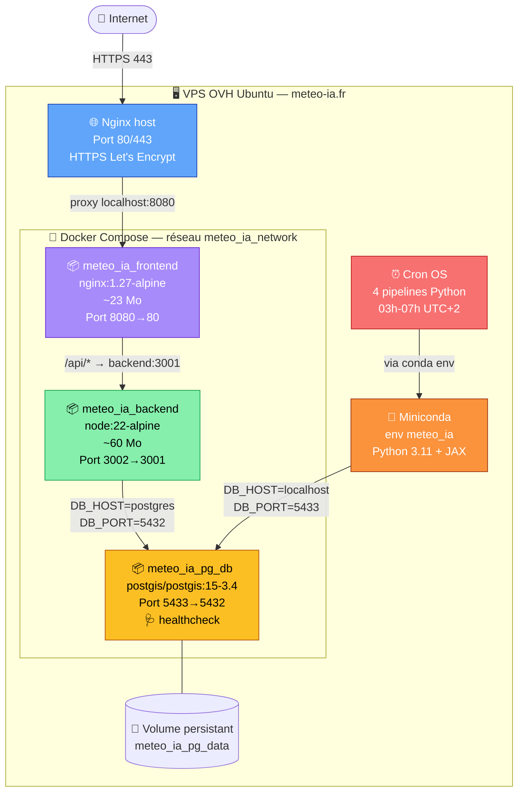
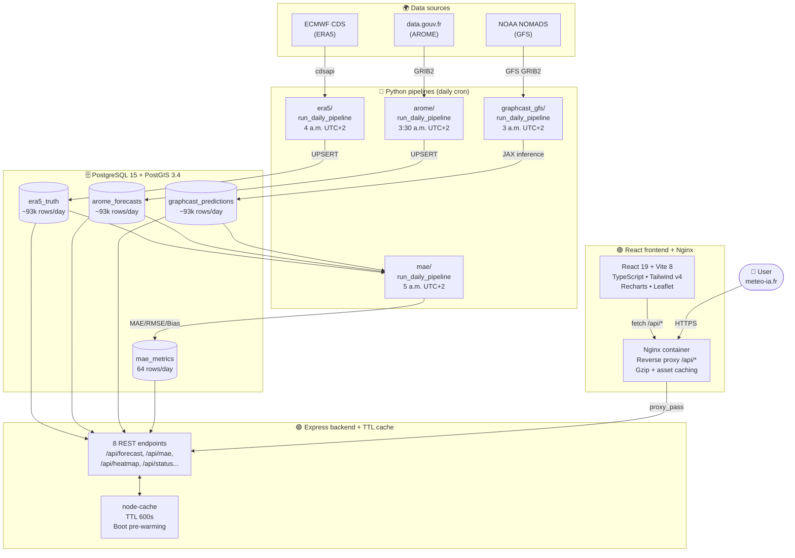
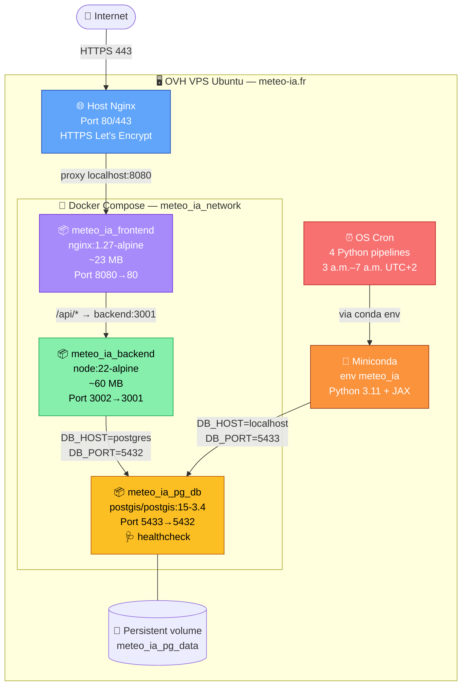

# 🌦️ Météo IA France

🌐 **[https://meteo-ia.fr](https://meteo-ia.fr)** | 📄 MIT License
**Stack** : React • TypeScript • Express • PostgreSQL + PostGIS • JAX • GraphCast • AROME • ERA5 • Docker • Docker Compose • Nginx • TanStack Query • Recharts • Leaflet • ETL Python • Cron • TTL Cache • Healthchecks • Reverse Proxy

🇬🇧 *English version below* ([jump to English](#-france-ai-weather))

---

> Dans le secteur de l'énergie, **chaque heure de prévision météo erronée se paie cash** : production solaire et éolienne mal anticipées, déséquilibres entre production et consommation, sanctions sur les marchés intraday. La majorité des acteurs s'appuient aujourd'hui sur les modèles physiques de l'ECMWF — précis mais **lourds en calcul** et **mis à jour seulement deux fois par jour**. Si la météo bascule entre deux runs, leurs estimations deviennent obsolètes. L'enjeu est largement documenté dans l'article *[Intraday power trading: toward an arms race in weather forecasting?](https://github.com/adecholaA1/meteo_ia_france/blob/main/An%20_arms_race_in_weather_forecasting.pdf)* (Kuppelwieser & Wozabal).
>
> Météo IA France a été conçu pour répondre à ce besoin précis : **fournir aux acteurs de l'énergie des prévisions météo de très grande précision**, générées par des modèles de Deep Learning (GraphCast, Pangu-Weather, ClimaX, ...), permettant d'estimer avec finesse la **production solaire et éolienne** et d'anticiper les fluctuations avant les autres acteurs du marché. La plateforme s'appuie sur deux piliers : (1) une **fonctionnalité principale gratuite et open-source** qui génère quotidiennement des prévisions IA visualisées sur une carte interactive de la France métropolitaine, comparées au modèle physique régional AROME (Météo-France) et à la vérité terrain ERA5 (ECMWF) ; (2) une **fonctionnalité premium** qui permettra à un client énergéticien de **ré-entraîner les modèles localement sur sa zone d'intérêt** (parc solaire, parc éolien, région réseau) pour atteindre des précisions inégalées sur son périmètre métier.
>
> Le résultat : **une application 100 % autonome, dockerisée et open-source, qui produit chaque jour des prévisions météo IA de haute précision** — à destination des trading desks intraday, opérateurs de parcs solaires/éoliens, gestionnaires de réseau et chercheurs en météorologie numérique. Trois cas d'usage concrets : optimisation de la production des parcs renouvelables intégrés au mix énergétique, aide au trading intra-journalier d'électricité, et maintien de la stabilité du réseau face à l'intermittence des renouvelables.

🌐 **Dashboard en ligne : [https://meteo-ia.fr](https://meteo-ia.fr)**


---

## 📑 Sommaire

1. [🎯 Présentation](#-présentation)
2. [🏆 Résultats clés](#-résultats-clés)
3. [🏗️ Architecture du projet](#️-architecture-du-projet)
4. [🐳 Architecture Docker](#-architecture-docker)
5. [🔄 Pipeline automatisé](#-pipeline-automatisé)
6. [🤖 Les 3 modèles comparés](#-les-3-modèles-comparés)
7. [🛠️ Stack technique](#️-stack-technique)
8. [🚀 Démarrer en quelques clics](#-démarrer-en-quelques-clics)
9. [⚙️ Installation locale détaillée](#️-installation-locale-détaillée)
10. [☁️ Déploiement (VPS OVH)](#️-déploiement-vps-ovh)
11. [📡 Endpoints API](#-endpoints-api)
12. [📚 Documentation](#-documentation)
13. [🗺️ Roadmap](#️-roadmap)
14. [🤝 Contribuer](#-contribuer)
15. [📄 Licence & contact](#-licence--contact)
16. [🙏 Sources de données](#-sources-de-données)

---

## 🎯 Présentation

Le dashboard affiche et compare en temps quasi-réel pour la **France métropolitaine** :

- **🟢 ERA5** — Vérité terrain ECMWF (ré-analyse), latence J-6, **mise à jour quotidienne à 6h UTC+2**
- **🔵 AROME** — Modèle physique régional Météo-France, run 18z UTC, **mise à jour quotidienne à 5h30 UTC+2**
- **🟠 GraphCast** — Modèle IA Google DeepMind sur GFS NOMADS, run 18z UTC, **mise à jour quotidienne à 5h UTC+2**
- **📊 MAE / RMSE / Bias** — métriques d'erreur calculées sur les 2 925 points de la grille France 0,25°, **recalculées à 7h UTC+2**

Le tout exposé via une **API REST** (8 endpoints + cache TTL) alimentant un **dashboard React** avec carte interactive, 6 graphiques temps série synchronisés, tableau MAE et page Méthodologie bilingue (FR/EN).

---

## 🏆 Résultats clés

À horizon **24 h**, sur la France métropolitaine, **moyenne 7 derniers jours**, **2 925 points de grille × 4 horizons par variable** :

| Variable                         | AROME (MAE) | GraphCast (MAE) | Ratio        |
| -------------------------------- | :---------: | :-------------: | :----------: |
| 🌡️ Température 2 m (°C)          | **1,1**     | 6,4             | **×5,8**     |
| 🌬️ Vitesse vent 10 m (m/s)       | **1,0**     | 1,8             | **×1,9**     |
| 🧭 Direction vent 10 m (°)       | **29**      | 91              | **×3,1**     |
| ☁️ Pression mer (hPa)            | **0,5**     | 2,7             | **×5,1**     |
| 🌧️ Précipitations 6 h (mm)       | 0,28        | 0,27            | ×1,0         |
| ☀️ TOA solaire (W/m²)            | identique   | identique       | identique    |

➡️ **AROME devance GraphCast Operational sur 4 des 5 variables comparables**, avec des facteurs allant de ×1,9 à ×5,8 — résultats cohérents avec la littérature : les modèles IA fondation **non spécialisés régionalement** n'égalent pas les modèles physiques régionaux à courte/moyenne échéance.

> 📊 **Détails complets** : voir [BENCHMARKS.md](./BENCHMARKS.md)

---

## 🏗️ Architecture du projet

Le système est composé de **4 pipelines Python** (acquisition + IA), une **base PostgreSQL avec PostGIS**, un **backend Express** (cache TTL + 8 endpoints REST) et un **frontend React** servi par Nginx, le tout orchestré par **Docker Compose** sur un VPS OVH.



> 💡 **Pourquoi ce design ?** Les pipelines tournent **hors Docker** (sur l'OS du VPS) car l'inférence GraphCast nécessite ~6 Go de RAM et un environnement conda spécifique. La DB et le couple backend/frontend sont **dans Docker** pour faciliter le déploiement et l'isolation. Le cache TTL côté backend évite de re-requêter la DB à chaque rechargement de page.

---

## 🐳 Architecture Docker

3 conteneurs orchestrés par `docker-compose`, healthchecks, volumes persistants, réseau isolé.



> 🔐 **Sécurité** : variables sensibles (mots de passe DB, clé CDS) externalisées dans `.env.production` non commité ; HTTPS via Certbot avec renouvellement automatique tous les 90 jours ; `helmet`, CORS strict, rate-limit 500 req/h/IP côté backend.

---

## 🔄 Pipeline automatisé

| Pipeline                          | Planification (UTC+2) | Description                                                              |
| --------------------------------- | :--------------------- | ------------------------------------------------------------------------ |
| `graphcast_gfs.run_daily_pipeline`| 03h00                  | Télécharge GFS NOMADS (28 fichiers GRIB2) + inférence JAX (~6 min)       |
| `arome.run_daily_pipeline`        | 03h30                  | Télécharge AROME data.gouv.fr (4 fichiers GRIB2) + ingestion DB           |
| `era5.run_daily_pipeline`         | 04h00                  | Télécharge ERA5 via CDS Copernicus (latence J-6, vérité terrain)         |
| `mae.run_daily_pipeline`          | 05h00                  | Calcule MAE / RMSE / Bias entre les 3 sources, met à jour `mae_metrics`  |

Chaque pipeline supporte :
- **Mode auto** (cible = aujourd'hui) ou **manuel** (`--date YYYY-MM-DD`)
- **Retry 3× avec pause 30 min** en cas d'échec API
- **UPSERT idempotent** sur `(timestamp, lat, lon, variable_name)` — ré-exécutable sans duplicata
- **Hook frontend** qui invalide + pré-réchauffe le cache backend après ingestion (latence < 200 ms pour le 1er visiteur)
- **Logging structuré** (console + fichier append-only dans `logs/`)

> 📊 **Volumétrie quotidienne** : 4 × 93 600 lignes ≈ **374 400 nouvelles lignes/jour**, ~100 Mo/mois en DB.

---

## 🤖 Les 3 modèles comparés

### 🟠 GraphCast Operational (Google DeepMind)

[GraphCast](https://github.com/google-deepmind/graphcast) est un **modèle de fondation pour la prévision météo** basé sur une architecture **Graph Neural Network**. Pré-entraîné sur 39 ans de ré-analyses ERA5 puis fine-tuné sur GFS, il est capable de produire en quelques minutes (sur GPU) des prévisions globales à 0,25° de résolution sur **13 niveaux atmosphériques** et 4 horizons (+6h, +12h, +18h, +24h).

**Pourquoi c'est pertinent ?** Là où les modèles physiques (ECMWF HRES, ARPEGE, AROME) requièrent **des supercalculateurs** et **plusieurs heures de calcul**, GraphCast tourne en **~5–8 min sur CPU** ou **<1 min sur GPU**. Cela ouvre la voie à des **runs intra-journaliers fréquents** — un avantage décisif pour le trading intraday d'électricité.

**Limitations en zero-shot** : sans spécialisation régionale, GraphCast est moins précis qu'un modèle physique local comme AROME (cf. résultats clés ci-dessus). Le fine-tuning sur ERA5 régional (V2.0 du projet) est attendu pour combler l'écart.

### 🔵 AROME (Météo-France)

[AROME](https://meteofrance.com/le-modele-aurelhy-haute-resolution) est le **modèle physique régional** opéré par Météo-France à **résolution native 0,025°** (~2,5 km), spécialisé sur l'Europe de l'Ouest. Il résout les équations de la dynamique atmosphérique (Navier-Stokes, équations de continuité, thermodynamique) avec assimilation de données satellites + sol toutes les heures.

**Compromis V1.0** : nous ré-échantillonnons AROME de 0,025° à 0,25° pour aligner la grille avec ERA5/GraphCast. Cela **désavantage AROME** (perte de 90% de sa résolution spatiale) mais reste loyal car le frontend affiche la même grille pour tous les modèles. La résolution native sera réintroduite en V2.0.

### 🟢 ERA5 (ECMWF Copernicus)

[ERA5](https://www.ecmwf.int/en/forecasts/dataset/ecmwf-reanalysis-v5) est la **ré-analyse atmosphérique de référence mondiale**, produite par l'ECMWF dans le cadre du programme Copernicus. C'est notre **vérité terrain** : pour chaque heure passée (latence J-6), ERA5 fournit l'état atmosphérique le plus proche de la réalité grâce à l'assimilation de **toutes les observations disponibles** (satellites, stations sol, ballons-sondes, navires…).

ERA5 sert d'étalon pour mesurer le MAE / RMSE / Bias d'AROME et GraphCast.

---

## 🛠️ Stack technique

### 🐍 Pipelines Python & Data Engineering

| Couche                | Technologie                                          | Version |
| --------------------- | ---------------------------------------------------- | :-----: |
| Langage               | Python                                               | 3.11    |
| Manipulation données  | xarray, pandas, numpy, scipy                         | latest  |
| Téléchargement        | cdsapi, httpx, requests                              | latest  |
| Format météo          | eccodes, cfgrib                                      | latest  |
| IA Météo              | JAX + GraphCast (open weights DeepMind)              | 0.9.2   |
| Orchestration         | Cron + Conda                                         | -       |
| Logging               | Python logging (console + file)                      | -       |

### 🟢 Backend

| Couche                | Technologie                                          | Version |
| --------------------- | ---------------------------------------------------- | :-----: |
| Runtime               | Node.js                                              | 22 LTS  |
| Framework             | Express                                              | 4.x     |
| Base de données       | PostgreSQL + PostGIS                                 | 15 / 3.4|
| Driver SQL            | pg (raw SQL, pas d'ORM)                              | 8.x     |
| Cache                 | node-cache (TTL 600s)                                | -       |
| Sécurité              | helmet, cors, express-rate-limit (500 req/h)         | -       |

### 🟣 Frontend

| Couche                | Technologie                                          | Version |
| --------------------- | ---------------------------------------------------- | :-----: |
| Framework             | React + TypeScript                                   | 19 / 5  |
| Build                 | Vite                                                 | 8.x     |
| UI                    | Tailwind CSS v4 + shadcn/ui (Radix)                  | 4.x     |
| Charts                | Recharts                                             | 2.x     |
| Carte                 | Leaflet + Stadia Maps                                | 1.x     |
| HTTP client           | TanStack Query v5                                    | 5.x     |
| i18n                  | Routes séparées FR/EN (react-router-dom v7)          | 7.x     |
| Dark mode             | OKLCH (CSS Color Level 4)                            | -       |

### 🐳 DevOps & Infrastructure

| Couche                | Technologie                                          | Version |
| --------------------- | ---------------------------------------------------- | :-----: |
| Conteneurisation      | Docker + Docker Compose                              | 28+ / 5+|
| Reverse proxy         | Nginx (host + container)                             | 1.27    |
| HTTPS                 | Let's Encrypt + Certbot (renouvellement auto)        | 2.11    |
| Hébergement           | VPS OVH Ubuntu 25.04                                 | -       |
| Healthchecks          | wget, pg_isready, depends_on                         | -       |
| Volumes persistants   | Docker named volumes                                 | -       |
| Versioning DB         | Backup `.sql` (333 Mo) via Git LFS                   | -       |

---

## 🚀 Démarrer en quelques clics

**Le moyen le plus rapide de tester le projet en local :**

```bash
# 1. Cloner le repo (Git LFS requis pour le backup DB de 333 Mo)
git lfs install
git clone https://github.com/adecholaA1/meteo_ia_france.git
cd meteo_ia_france

# 2. Copier le template de configuration
cp .env.production.example .env.production
# (Optionnel) éditer .env.production si tu veux changer les ports/mots de passe

# 3. Lancer toute la stack en un seul appel
docker compose --env-file .env.production up -d --build
```

⏱️ Au premier lancement, le backup de 333 Mo s'importe dans Postgres (~30 sec). Une fois les 3 conteneurs `healthy`, **ouvre [http://localhost:8080](http://localhost:8080)** dans ton navigateur. 🎉

---

## ⚙️ Installation locale détaillée

### Prérequis

- [Docker Desktop](https://www.docker.com/products/docker-desktop/) (>= 24)
- [Git LFS](https://git-lfs.com/) (pour cloner le backup DB)
- (Optionnel) [Miniconda](https://docs.conda.io/projects/miniconda/) si tu veux **régénérer les données** depuis les sources

### 1. Cloner le dépôt

```bash
git lfs install
git clone https://github.com/adecholaA1/meteo_ia_france.git
cd meteo_ia_france
```

### 2. Configurer les variables d'environnement

```bash
cp .env.production.example .env.production
nano .env.production
# Renseigner DB_PASSWORD, CDS_API_KEY (pour ERA5), CORS_ORIGINS, etc.
```

### 3. Lancer la stack Docker

```bash
docker compose --env-file .env.production up -d --build
docker compose --env-file .env.production ps
# meteo_ia_pg_db_compose  Healthy   5433→5432
# meteo_ia_backend         Healthy   3002→3001
# meteo_ia_frontend        Healthy   8080→80
```

### 4. (Optionnel) Régénérer les données depuis les sources

Si tu veux exécuter les pipelines Python (au lieu d'utiliser le backup de 333 Mo) :

```bash
# Créer l'env conda
conda env create -f environment.yml
conda activate meteo_ia
pip install -r requirements.txt

# Configurer la clé CDS Copernicus
echo "url: https://cds.climate.copernicus.eu/api" > ~/.cdsapirc
echo "key: <TA_CLE>" >> ~/.cdsapirc
chmod 600 ~/.cdsapirc

# Charger les variables d'env DB
source load_env.sh

# Lancer les 4 pipelines (ordre logique)
cd scripts
python -m graphcast_gfs.run_daily_pipeline   # ~6 min
python -m arome.run_daily_pipeline           # ~5 min
python -m era5.run_daily_pipeline            # ~3 min (latence J-6)
python -m mae.run_daily_pipeline             # ~1 min
```

📚 Documentation complète des pipelines : [scripts/README.md](./scripts/README.md)

---

## ☁️ Déploiement (VPS OVH)

Le projet est déployé sur un **VPS OVH Ubuntu 25.04** (11 Go RAM, 70 Go disque) avec :

- **Nginx host** comme reverse proxy + HTTPS Let's Encrypt
- **Docker Compose** orchestrant les 3 conteneurs (postgres + backend + frontend)
- **Miniconda** + env `meteo_ia` pour les pipelines Python (hors Docker)
- **Cron quotidien** pour l'acquisition automatique des données

```bash
# Sur le VPS
git lfs install
git clone https://github.com/adecholaA1/meteo_ia_france.git
cd meteo_ia_france
cp .env.production.example .env.production
nano .env.production   # remplir les vraies valeurs

docker compose --env-file .env.production up -d --build
```

Puis configuration Nginx host + Certbot :

```bash
sudo nano /etc/nginx/sites-available/meteo-ia.fr
# proxy_pass http://localhost:8080;

sudo ln -s /etc/nginx/sites-available/meteo-ia.fr /etc/nginx/sites-enabled/
sudo certbot --nginx -d meteo-ia.fr -d www.meteo-ia.fr
sudo systemctl reload nginx
```

Puis activation du crontab pour les 4 pipelines :

```cron
# Météo IA France — Pipelines quotidiens (heure FR = UTC+2)
0  3 * * * cd /home/ubuntu/meteo_ia_france/scripts && source ../load_env.sh && /home/ubuntu/miniconda3/envs/meteo_ia/bin/python -m graphcast_gfs.run_daily_pipeline >> ../logs/graphcast.log 2>&1
30 3 * * * cd /home/ubuntu/meteo_ia_france/scripts && source ../load_env.sh && /home/ubuntu/miniconda3/envs/meteo_ia/bin/python -m arome.run_daily_pipeline          >> ../logs/arome.log     2>&1
0  4 * * * cd /home/ubuntu/meteo_ia_france/scripts && source ../load_env.sh && /home/ubuntu/miniconda3/envs/meteo_ia/bin/python -m era5.run_daily_pipeline           >> ../logs/era5.log      2>&1
0  5 * * * cd /home/ubuntu/meteo_ia_france/scripts && source ../load_env.sh && /home/ubuntu/miniconda3/envs/meteo_ia/bin/python -m mae.run_daily_pipeline            >> ../logs/mae.log       2>&1
```

---

## 📡 Endpoints API

| Méthode | Route                                  | Description                                                  |
| :-----: | -------------------------------------- | ------------------------------------------------------------ |
| GET     | `/api/health`                          | Healthcheck (DB + uptime)                                    |
| GET     | `/api/status`                          | Compteurs des 4 tables + stats cache + uptime                |
| GET     | `/api/forecast/available-times`        | Liste des `(date, hour)` disponibles par source              |
| GET     | `/api/forecast/grid-points`            | 2 925 points GPS de la grille France (chargé une fois)       |
| GET     | `/api/forecast/timeseries`             | 7 jours × 6 variables × 3 sources pour 1 point GPS           |
| GET     | `/api/forecast/:date/:hour`            | Grille complète à un instant T pour 1 source/variable        |
| GET     | `/api/mae/comparison`                  | Tableau MAE moyen 7 derniers jours (toutes variables)        |
| GET     | `/api/mae/history`                     | Évolution quotidienne du MAE pour 1 variable                 |
| GET     | `/api/heatmap/error`                   | Grille d'écart spatial `(source - era5)`                     |

📚 Documentation complète : [backend/README.md](./backend/README.md) + [BACKEND.md](./BACKEND.md)

---

## 📚 Documentation

| Document                                              | Rôle                                                         | Audience                  |
| ----------------------------------------------------- | ------------------------------------------------------------ | ------------------------- |
| 🌟 [README.md](./README.md) (ce fichier)              | Vision globale + démarrage rapide                            | Recruteur, contributeur   |
| 🏛️ [ARCHITECTURE.md](./ARCHITECTURE.md)               | Architecture technique end-to-end + décisions                | Architecte, dev           |
| 📊 [BENCHMARKS.md](./BENCHMARKS.md)                   | Résultats mesurés + méthodologie scientifique                | Data scientist, recruteur |
| 🐍 [scripts/README.md](./scripts/README.md)           | Doc des 4 pipelines Python                                   | Dev pipelines             |
| 🟢 [BACKEND.md](./BACKEND.md)                         | Doc des 8 endpoints REST + cache TTL                         | Dev backend               |
| 🟣 [FRONTEND.md](./FRONTEND.md)                       | Doc des composants React                                     | Dev frontend              |
| 💼 [BUSINESS.md](./BUSINESS.md)                       | Vision marché, cas d'usage, monétisation                     | Recruteur business        |

🌐 **Page Méthodologie publique** : `/fr/methodologie` ou `/en/methodology` directement sur le dashboard, avec 8 sections (glossaire de 16 sigles, 6 variables expliquées, 3 sources comparées, tableau comparatif, limitations V1.0, roadmap V2.0, stack).

---

## 🗺️ Roadmap

### ✅ V1.0 — Production publique (avril 2026)

- ✅ 4 pipelines Python automatisés (ERA5, AROME, GraphCast, MAE) avec retry + UPSERT idempotent
- ✅ Inférence GraphCast Operational sur CPU (~6 min/run, 4 horizons +6h/+12h/+18h/+24h)
- ✅ Base PostgreSQL 15 + PostGIS 3.4 (~2 M lignes, 4 tables, format LONG, vues `*_fresh`)
- ✅ Backend Express avec 8 endpoints REST + cache TTL 600s + pre-warming au boot
- ✅ Frontend React 19 + TypeScript 5 + Vite 8 (carte interactive Leaflet, 6 graphiques Recharts synchronisés, tableau MAE, mode dark/light, FR/EN)
- ✅ Page Méthodologie publique bilingue (8 sections, glossaire, comparatifs)
- ✅ Dockerisation complète (3 conteneurs orchestrés par Docker Compose, healthchecks, volumes persistants)
- ✅ Déploiement VPS OVH avec HTTPS Let's Encrypt + reverse proxy Nginx
- ✅ Cron quotidien (4 pipelines entre 03h et 05h heure FR)
- ✅ MAE circulaire pour `wind_direction` (variable cyclique)
- ✅ Backup DB 333 Mo versionné via Git LFS

### 🟡 V1.1 — Court terme (post-déploiement)

**🧪 Qualité & tests**
- 🟡 Tests unitaires backend (Jest + supertest) sur les 8 endpoints REST
- 🟡 Tests unitaires frontend (Vitest + React Testing Library) sur les hooks et composants critiques
- 🟡 Tests d'intégration des 4 pipelines Python (pytest)
- 🟡 Pre-commit hooks (Husky + lint-staged + Prettier + ESLint)
- 🟡 Code coverage avec Codecov (objectif 70 %)

**🤖 CI/CD GitHub Actions**
- 🟡 Workflow `lint-typecheck` sur chaque PR (tsc --noEmit + ESLint)
- 🟡 Workflow `build-docker` qui build les 2 images Docker sur push to main
- 🟡 Workflow `deploy` qui SSH sur le VPS et exécute `git pull && docker compose up -d --build`

**⚡ Refactoring architectural GraphCast**
- 🟡 FastAPI dédiée GraphCast (port 8001) pour exposer l'inférence en on-demand au lieu du cron in-process
- 🟡 Bias correction GraphCast par variable / région / saison (offset appris sur ERA5)

**🛡️ Sécurité & robustesse**
- 🟡 Endpoint `POST /api/cache/flush` pour invalidation manuelle après ingestion
- 🟡 Authentification basique (clé API en header) si l'API est exposée publiquement
- 🟡 Hide error stack traces en production

### 🔵 V2.0 — Moyen terme (fonctionnalité premium)

**💎 Fine-tuning local (cœur du modèle premium)**
- 🟡 Module de **ré-entraînement client** : un opérateur de parc solaire/éolien pourra fine-tuner GraphCast (ou Pangu-Weather) sur ERA5 régional autour de sa zone d'intérêt, avec gain de précision attendu de **30 à 50 %** sur ses variables clés (cf. littérature)
- 🟡 Interface web pour lancer le fine-tuning, monitorer la convergence, déployer le modèle entraîné
- 🟡 Comparaison automatique modèle générique vs modèle fine-tuné

**🤖 Nouveaux modèles**
- 🟡 **Pangu-Weather (Huawei)** : architecture hiérarchique 1h/3h/6h/24h, plus rapide que GraphCast
- 🟡 **Ensembling Pangu-Weather + AROME** (moyenne pondérée par variable)
- 🟡 **AROME résolution native 0,025°** (~2,5 km) pour ne plus désavantager AROME dans la comparaison

**📊 Données enrichies**
- 🟡 Multi-runs quotidiens (4 à 8 runs/jour, exploitation de l'avantage IA en intraday)
- 🟡 Pas de temps horaire (capter cycles diurnes et fronts météo rapides)
- 🟡 Variable `total_cloud_cover` pour calcul GHI au sol (production photovoltaïque réelle)
- 🟡 Vent à 100 m pour parcs éoliens (variables 3D)

### 🟣 V3.0 — Long terme (produit B2B)

- 🟡 **ClimaX (Microsoft)** fine-tuné comme alternative à GraphCast / Pangu-Weather
- 🟡 **Production photovoltaïque calculée** via modèle PV (GHI + température cellule)
- 🟡 **Production éolienne calculée** via courbes de puissance des turbines
- 🟡 Authentification utilisateur, plans payants, dashboards personnalisés par parc/région
- 🟡 Alertes temps réel sur déviations significatives entre modèles (notifications email/Slack)
- 🟡 API publique avec quotas et SLA pour clients B2B

---

## 🤝 Contribuer

Les contributions sont bienvenues ! Que tu sois météorologue, data scientist, dev ou simplement curieux :

1. Vérifie d'abord les [issues existantes](https://github.com/adecholaA1/meteo_ia_france/issues)
2. Crée une nouvelle issue avec une description claire (étapes, environnement, logs)
3. Pour une PR : fork → branche `feat/ma-feature` → respect de la convention `feat: / fix: / docs: / refactor: / test:` → mise à jour de la doc impactée → PR claire

**Idées de contribution** :
- 🌍 Traductions (DE, ES, IT) des README et de l'interface
- 🤖 Ajout de nouveaux modèles IA (Pangu-Weather, ClimaX, Aurora)
- 📊 Nouvelles métriques (ACC, CRPS pour ensembles)
- 🗺️ Extension à d'autres zones (Europe, monde)
- 🧪 Tests unitaires et d'intégration

---

## 📄 Licence & contact

### Licence

Distribué sous **licence MIT** — libre d'utilisation, de modification et de distribution. Voir [LICENSE](./LICENSE).

### Contact

- 📧 **Email** : [kadechola@gmail.com](mailto:kadechola@gmail.com)
- 💼 **LinkedIn** : [linkedin.com/in/kadechola](https://www.linkedin.com/in/kadechola/)

### Remerciements

- **ECMWF** pour ERA5 et le Climate Data Store (accès gratuit)
- **NOAA** pour GFS et NOMADS (accès gratuit)
- **Météo-France** pour AROME via data.gouv.fr (open data)
- **Google DeepMind** pour les open weights de GraphCast
- **La communauté open-source** (Python, JAX, React, PostgreSQL, Docker…)

---

## 🙏 Sources de données

- 🟢 **ERA5 (vérité terrain)** : [ECMWF Climate Data Store](https://cds.climate.copernicus.eu/) — latence J-6
- 🔵 **AROME (Météo-France)** : [data.gouv.fr](https://www.data.gouv.fr/fr/datasets/donnees-de-modele-aurelhy/) — open data
- 🟠 **GFS NOMADS (input GraphCast)** : [NOAA NOMADS](https://nomads.ncep.noaa.gov/) — accès libre
- 🤖 **GraphCast Operational** : [Google DeepMind](https://github.com/google-deepmind/graphcast) — open weights

---

<br/>

# 🌦️ France AI Weather

🌐 **[https://meteo-ia.fr](https://meteo-ia.fr)** | 📄 MIT License
**Stack** : React • TypeScript • Express • PostgreSQL + PostGIS • JAX • GraphCast • AROME • ERA5 • Docker • Docker Compose • Nginx • TanStack Query • Recharts • Leaflet • ETL Python • Cron • TTL Cache • Healthchecks • Reverse Proxy

🇫🇷 *Version française au-dessus* ([go to French](#-météo-ia-france))

---

> In the energy sector, **every hour of inaccurate weather forecast comes at a cost**: solar and wind production poorly anticipated, imbalances between supply and demand, penalties on intraday markets. Most actors today rely on ECMWF physical models — accurate but **computationally heavy** and **updated only twice a day**. If the weather shifts between two runs, their estimates become obsolete. The economic stakes are extensively documented in the article *[Intraday power trading: toward an arms race in weather forecasting?](https://github.com/adecholaA1/meteo_ia_france/blob/main/An%20_arms_race_in_weather_forecasting.pdf)* (Kuppelwieser & Wozabal).
>
> France AI Weather was designed to address this specific need: **delivering highly accurate weather forecasts to energy players**, powered by Deep Learning models (GraphCast, Pangu-Weather, ClimaX, ...), enabling precise estimation of **solar and wind power production** and anticipating market shifts ahead of other players. The platform rests on two pillars: (1) a **free, open-source core feature** that generates daily AI forecasts visualized on an interactive map of metropolitan France, benchmarked against the regional physical model AROME (Météo-France) and the ground-truth reanalysis ERA5 (ECMWF); (2) a **premium feature** that will allow an energy client to **fine-tune the models locally on their area of interest** (solar farm, wind farm, grid region) to reach unmatched precision on their specific business perimeter.
>
> The result: **a fully autonomous, dockerized, open-source application that delivers high-precision AI weather forecasts every day** — designed for intraday trading desks, solar/wind farm operators, grid managers, and numerical weather prediction researchers. Three concrete use cases: optimizing production of renewable farms integrated into the energy mix, supporting intraday electricity trading, and maintaining grid stability against renewable intermittency.

🌐 **Live demo: [https://meteo-ia.fr](https://meteo-ia.fr)**


---

## 📑 Table of contents

1. [🎯 Overview](#-overview)
2. [🏆 Key results](#-key-results)
3. [🏗️ Project architecture](#️-project-architecture)
4. [🐳 Docker architecture](#-docker-architecture)
5. [🔄 Automated pipeline](#-automated-pipeline)
6. [🤖 The 3 compared models](#-the-3-compared-models)
7. [🛠️ Tech stack](#️-tech-stack)
8. [🚀 Quick start in a few clicks](#-quick-start-in-a-few-clicks)
9. [⚙️ Detailed local installation](#️-detailed-local-installation)
10. [☁️ Deployment (OVH VPS)](#️-deployment-ovh-vps)
11. [📡 API endpoints](#-api-endpoints)
12. [📚 Documentation](#-documentation-1)
13. [🗺️ Roadmap](#️-roadmap-1)
14. [🤝 Contributing](#-contributing)
15. [📄 License & contact](#-license--contact)
16. [🙏 Data sources](#-data-sources)

---

## 🎯 Overview

The dashboard displays and compares in near real-time over **metropolitan France**:

- **🟢 ERA5** — ECMWF reanalysis (ground truth), D-6 latency, **updated daily at 6 a.m. UTC+2**
- **🔵 AROME** — Météo-France regional physical model, run 18z UTC, **updated daily at 5:30 a.m. UTC+2**
- **🟠 GraphCast** — Google DeepMind AI model on GFS NOMADS, run 18z UTC, **updated daily at 5 a.m. UTC+2**
- **📊 MAE / RMSE / Bias** — error metrics computed over 2,925 grid points (France 0.25°), **recomputed at 7 a.m. UTC+2**

Everything is exposed via a **REST API** (8 endpoints + TTL cache) feeding a **React dashboard** with interactive map, 6 synchronized time-series charts, MAE table, and bilingual (FR/EN) Methodology page.

---

## 🏆 Key results

At **24-hour horizon**, over metropolitan France, **7-day rolling average**, **2,925 grid points × 4 horizons per variable**:

| Variable                         | AROME (MAE) | GraphCast (MAE) | Ratio        |
| -------------------------------- | :---------: | :-------------: | :----------: |
| 🌡️ Temperature 2 m (°C)          | **1.1**     | 6.4             | **×5.8**     |
| 🌬️ Wind speed 10 m (m/s)         | **1.0**     | 1.8             | **×1.9**     |
| 🧭 Wind direction 10 m (°)       | **29**      | 91              | **×3.1**     |
| ☁️ Sea-level pressure (hPa)      | **0.5**     | 2.7             | **×5.1**     |
| 🌧️ Precipitation 6 h (mm)        | 0.28        | 0.27            | ×1.0         |
| ☀️ TOA solar (W/m²)              | identical   | identical       | identical    |

➡️ **AROME outperforms GraphCast Operational on 4 out of 5 comparable variables**, with factors ranging from ×1.9 to ×5.8 — results consistent with literature: AI foundation models **without regional specialization** don't match regional physical models at short/medium range.

> 📊 **Full details**: see [BENCHMARKS.md](./BENCHMARKS.md)

---

## 🏗️ Project architecture

The system consists of **4 Python pipelines** (acquisition + AI), a **PostgreSQL database with PostGIS**, an **Express backend** (TTL cache + 8 REST endpoints), and a **React frontend** served by Nginx, all orchestrated by **Docker Compose** on an OVH VPS.



> 💡 **Why this design?** The pipelines run **outside Docker** (on the VPS OS) because GraphCast inference requires ~6 GB of RAM and a specific conda environment. The DB and backend/frontend pair are **inside Docker** to ease deployment and isolation. The TTL cache on the backend avoids re-querying the DB on every page reload.

---

## 🐳 Docker architecture

3 containers orchestrated by `docker-compose`, healthchecks, persistent volumes, isolated network.



> 🔐 **Security**: sensitive variables (DB passwords, CDS key) externalized in non-committed `.env.production`; HTTPS via Certbot with automatic renewal every 90 days; `helmet`, strict CORS, rate-limit 500 req/h/IP on the backend.

---

## 🔄 Automated pipeline

| Pipeline                          | Schedule (UTC+2) | Description                                                              |
| --------------------------------- | :---------------- | ------------------------------------------------------------------------ |
| `graphcast_gfs.run_daily_pipeline`| 3:00 a.m.         | Downloads GFS NOMADS (28 GRIB2 files) + JAX inference (~6 min)           |
| `arome.run_daily_pipeline`        | 3:30 a.m.         | Downloads AROME data.gouv.fr (4 GRIB2 files) + DB ingestion              |
| `era5.run_daily_pipeline`         | 4:00 a.m.         | Downloads ERA5 via CDS Copernicus (D-6 latency, ground truth)            |
| `mae.run_daily_pipeline`          | 5:00 a.m.         | Computes MAE / RMSE / Bias between the 3 sources, updates `mae_metrics`  |

Each pipeline supports:
- **Auto mode** (target = today) or **manual** (`--date YYYY-MM-DD`)
- **Retry 3× with 30-min pause** on API failure
- **Idempotent UPSERT** on `(timestamp, lat, lon, variable_name)` — re-executable without duplicates
- **Frontend hook** that invalidates + pre-warms the backend cache after ingestion (latency < 200 ms for the 1st visitor)
- **Structured logging** (console + append-only file in `logs/`)

> 📊 **Daily volume**: 4 × 93,600 rows ≈ **374,400 new rows/day**, ~100 MB/month in DB.

---

## 🤖 The 3 compared models

### 🟠 GraphCast Operational (Google DeepMind)

[GraphCast](https://github.com/google-deepmind/graphcast) is a **foundation model for weather forecasting** based on a **Graph Neural Network** architecture. Pre-trained on 39 years of ERA5 reanalyses then fine-tuned on GFS, it can produce in just minutes (on GPU) global forecasts at 0.25° resolution over **13 atmospheric levels** and 4 horizons (+6h, +12h, +18h, +24h).

**Why is it relevant?** Where physical models (ECMWF HRES, ARPEGE, AROME) require **supercomputers** and **several hours of computation**, GraphCast runs in **~5–8 min on CPU** or **<1 min on GPU**. This opens the door to **frequent intraday runs** — a decisive advantage for intraday electricity trading.

**Zero-shot limitations**: without regional specialization, GraphCast is less accurate than a local physical model like AROME (see key results above). Fine-tuning on regional ERA5 (V2.0 of the project) is expected to close the gap.

### 🔵 AROME (Météo-France)

[AROME](https://meteofrance.com/le-modele-aurelhy-haute-resolution) is the **regional physical model** operated by Météo-France at **0.025° native resolution** (~2.5 km), specialized for Western Europe. It solves the equations of atmospheric dynamics (Navier-Stokes, continuity equations, thermodynamics) with hourly assimilation of satellite + ground data.

**V1.0 trade-off**: we resample AROME from 0.025° to 0.25° to align the grid with ERA5/GraphCast. This **disadvantages AROME** (loss of 90% of its spatial resolution) but remains fair because the frontend displays the same grid for all models. Native resolution will be reintroduced in V2.0.

### 🟢 ERA5 (ECMWF Copernicus)

[ERA5](https://www.ecmwf.int/en/forecasts/dataset/ecmwf-reanalysis-v5) is the **world's reference atmospheric reanalysis**, produced by ECMWF as part of the Copernicus program. It is our **ground truth**: for every past hour (D-6 latency), ERA5 provides the closest atmospheric state to reality thanks to assimilation of **all available observations** (satellites, ground stations, weather balloons, ships…).

ERA5 serves as the benchmark for measuring AROME and GraphCast's MAE / RMSE / Bias.

---

## 🛠️ Tech stack

### 🐍 Python pipelines & Data Engineering

| Layer                 | Technology                                           | Version |
| --------------------- | ---------------------------------------------------- | :-----: |
| Language              | Python                                               | 3.11    |
| Data manipulation     | xarray, pandas, numpy, scipy                         | latest  |
| Download              | cdsapi, httpx, requests                              | latest  |
| Weather format        | eccodes, cfgrib                                      | latest  |
| Weather AI            | JAX + GraphCast (DeepMind open weights)              | 0.9.2   |
| Orchestration         | Cron + Conda                                         | -       |
| Logging               | Python logging (console + file)                      | -       |

### 🟢 Backend

| Layer                 | Technology                                           | Version |
| --------------------- | ---------------------------------------------------- | :-----: |
| Runtime               | Node.js                                              | 22 LTS  |
| Framework             | Express                                              | 4.x     |
| Database              | PostgreSQL + PostGIS                                 | 15 / 3.4|
| SQL driver            | pg (raw SQL, no ORM)                                 | 8.x     |
| Cache                 | node-cache (TTL 600s)                                | -       |
| Security              | helmet, cors, express-rate-limit (500 req/h)         | -       |

### 🟣 Frontend

| Layer                 | Technology                                           | Version |
| --------------------- | ---------------------------------------------------- | :-----: |
| Framework             | React + TypeScript                                   | 19 / 5  |
| Build                 | Vite                                                 | 8.x     |
| UI                    | Tailwind CSS v4 + shadcn/ui (Radix)                  | 4.x     |
| Charts                | Recharts                                             | 2.x     |
| Map                   | Leaflet + Stadia Maps                                | 1.x     |
| HTTP client           | TanStack Query v5                                    | 5.x     |
| i18n                  | Separate FR/EN routes (react-router-dom v7)          | 7.x     |
| Dark mode             | OKLCH (CSS Color Level 4)                            | -       |

### 🐳 DevOps & Infrastructure

| Layer                 | Technology                                           | Version |
| --------------------- | ---------------------------------------------------- | :-----: |
| Containerization      | Docker + Docker Compose                              | 28+ / 5+|
| Reverse proxy         | Nginx (host + container)                             | 1.27    |
| HTTPS                 | Let's Encrypt + Certbot (auto renewal)               | 2.11    |
| Hosting               | OVH VPS Ubuntu 25.04                                 | -       |
| Healthchecks          | wget, pg_isready, depends_on                         | -       |
| Persistent volumes    | Docker named volumes                                 | -       |
| DB versioning         | `.sql` backup (333 MB) via Git LFS                   | -       |

---

## 🚀 Quick start in a few clicks

**The fastest way to test the project locally:**

```bash
# 1. Clone the repo (Git LFS required for the 333 MB DB backup)
git lfs install
git clone https://github.com/adecholaA1/meteo_ia_france.git
cd meteo_ia_france

# 2. Copy the configuration template
cp .env.production.example .env.production
# (Optional) edit .env.production if you want to change ports/passwords

# 3. Launch the entire stack in a single call
docker compose --env-file .env.production up -d --build
```

⏱️ On the first launch, the 333 MB backup imports into Postgres (~30 sec). Once the 3 containers are `healthy`, **open [http://localhost:8080](http://localhost:8080)** in your browser. 🎉

---

## ⚙️ Detailed local installation

### Prerequisites

- [Docker Desktop](https://www.docker.com/products/docker-desktop/) (>= 24)
- [Git LFS](https://git-lfs.com/) (to clone the DB backup)
- (Optional) [Miniconda](https://docs.conda.io/projects/miniconda/) if you want to **regenerate data** from sources

### 1. Clone the repository

```bash
git lfs install
git clone https://github.com/adecholaA1/meteo_ia_france.git
cd meteo_ia_france
```

### 2. Configure environment variables

```bash
cp .env.production.example .env.production
nano .env.production
# Fill in DB_PASSWORD, CDS_API_KEY (for ERA5), CORS_ORIGINS, etc.
```

### 3. Launch the Docker stack

```bash
docker compose --env-file .env.production up -d --build
docker compose --env-file .env.production ps
# meteo_ia_pg_db_compose  Healthy   5433→5432
# meteo_ia_backend         Healthy   3002→3001
# meteo_ia_frontend        Healthy   8080→80
```

### 4. (Optional) Regenerate data from sources

If you want to run the Python pipelines (instead of using the 333 MB backup):

```bash
# Create the conda env
conda env create -f environment.yml
conda activate meteo_ia
pip install -r requirements.txt

# Configure the CDS Copernicus key
echo "url: https://cds.climate.copernicus.eu/api" > ~/.cdsapirc
echo "key: <YOUR_KEY>" >> ~/.cdsapirc
chmod 600 ~/.cdsapirc

# Load DB env variables
source load_env.sh

# Run the 4 pipelines (logical order)
cd scripts
python -m graphcast_gfs.run_daily_pipeline   # ~6 min
python -m arome.run_daily_pipeline           # ~5 min
python -m era5.run_daily_pipeline            # ~3 min (D-6 latency)
python -m mae.run_daily_pipeline             # ~1 min
```

📚 Full pipeline documentation: [scripts/README.md](./scripts/README.md)

---

## ☁️ Deployment (OVH VPS)

The project is deployed on an **OVH VPS Ubuntu 25.04** (11 GB RAM, 70 GB disk) with:

- **Host Nginx** as reverse proxy + Let's Encrypt HTTPS
- **Docker Compose** orchestrating the 3 containers (postgres + backend + frontend)
- **Miniconda** + `meteo_ia` env for Python pipelines (outside Docker)
- **Daily cron** for automatic data acquisition

```bash
# On the VPS
git lfs install
git clone https://github.com/adecholaA1/meteo_ia_france.git
cd meteo_ia_france
cp .env.production.example .env.production
nano .env.production   # fill in real values

docker compose --env-file .env.production up -d --build
```

Then host Nginx + Certbot configuration:

```bash
sudo nano /etc/nginx/sites-available/meteo-ia.fr
# proxy_pass http://localhost:8080;

sudo ln -s /etc/nginx/sites-available/meteo-ia.fr /etc/nginx/sites-enabled/
sudo certbot --nginx -d meteo-ia.fr -d www.meteo-ia.fr
sudo systemctl reload nginx
```

Then activation of the crontab for the 4 pipelines:

```cron
# Météo IA France — Daily pipelines (FR time = UTC+2)
0  3 * * * cd /home/ubuntu/meteo_ia_france/scripts && source ../load_env.sh && /home/ubuntu/miniconda3/envs/meteo_ia/bin/python -m graphcast_gfs.run_daily_pipeline >> ../logs/graphcast.log 2>&1
30 3 * * * cd /home/ubuntu/meteo_ia_france/scripts && source ../load_env.sh && /home/ubuntu/miniconda3/envs/meteo_ia/bin/python -m arome.run_daily_pipeline          >> ../logs/arome.log     2>&1
0  4 * * * cd /home/ubuntu/meteo_ia_france/scripts && source ../load_env.sh && /home/ubuntu/miniconda3/envs/meteo_ia/bin/python -m era5.run_daily_pipeline           >> ../logs/era5.log      2>&1
0  5 * * * cd /home/ubuntu/meteo_ia_france/scripts && source ../load_env.sh && /home/ubuntu/miniconda3/envs/meteo_ia/bin/python -m mae.run_daily_pipeline            >> ../logs/mae.log       2>&1
```

---

## 📡 API endpoints

| Method  | Route                                  | Description                                                  |
| :-----: | -------------------------------------- | ------------------------------------------------------------ |
| GET     | `/api/health`                          | Healthcheck (DB + uptime)                                    |
| GET     | `/api/status`                          | Counters of the 4 tables + cache stats + uptime              |
| GET     | `/api/forecast/available-times`        | List of `(date, hour)` available per source                  |
| GET     | `/api/forecast/grid-points`            | 2,925 GPS points of the France grid (loaded once)            |
| GET     | `/api/forecast/timeseries`             | 7 days × 6 variables × 3 sources for 1 GPS point             |
| GET     | `/api/forecast/:date/:hour`            | Full grid at instant T for 1 source/variable                 |
| GET     | `/api/mae/comparison`                  | 7-day rolling average MAE table (all variables)              |
| GET     | `/api/mae/history`                     | Daily MAE evolution for 1 variable                           |
| GET     | `/api/heatmap/error`                   | Spatial error grid `(source - era5)`                         |

📚 Full documentation: [backend/README.md](./backend/README.md) + [BACKEND.md](./BACKEND.md)

---

## 📚 Documentation

| Document                                              | Role                                                         | Audience                  |
| ----------------------------------------------------- | ------------------------------------------------------------ | ------------------------- |
| 🌟 [README.md](./README.md) (this file)               | Global vision + quick start                                  | Recruiter, contributor    |
| 🏛️ [ARCHITECTURE.md](./ARCHITECTURE.md)               | End-to-end technical architecture + decisions                | Architect, developer      |
| 📊 [BENCHMARKS.md](./BENCHMARKS.md)                   | Measured results + scientific methodology                    | Data scientist, recruiter |
| 🐍 [scripts/README.md](./scripts/README.md)           | 4 Python pipelines documentation                             | Pipeline developer        |
| 🟢 [BACKEND.md](./BACKEND.md)                         | 8 REST endpoints + TTL cache documentation                   | Backend developer         |
| 🟣 [FRONTEND.md](./FRONTEND.md)                       | React components documentation                               | Frontend developer        |
| 💼 [BUSINESS.md](./BUSINESS.md)                       | Market vision, use cases, monetization                       | Business recruiter        |

🌐 **Public Methodology page**: `/fr/methodologie` or `/en/methodology` directly on the dashboard, with 8 sections (16-acronym glossary, 6 explained variables, 3 compared sources, comparison table, V1.0 limitations, V2.0 roadmap, stack).

---

## 🗺️ Roadmap

### ✅ V1.0 — Public production (April 2026)

- ✅ 4 automated Python pipelines (ERA5, AROME, GraphCast, MAE) with retry + idempotent UPSERT
- ✅ GraphCast Operational inference on CPU (~6 min/run, 4 horizons +6h/+12h/+18h/+24h)
- ✅ PostgreSQL 15 + PostGIS 3.4 database (~2M rows, 4 tables, LONG format, `*_fresh` views)
- ✅ Express backend with 8 REST endpoints + 600s TTL cache + boot pre-warming
- ✅ React 19 + TypeScript 5 + Vite 8 frontend (Leaflet interactive map, 6 synchronized Recharts, MAE table, dark/light mode, FR/EN)
- ✅ Bilingual public Methodology page (8 sections, glossary, comparisons)
- ✅ Full dockerization (3 containers orchestrated by Docker Compose, healthchecks, persistent volumes)
- ✅ OVH VPS deployment with HTTPS Let's Encrypt + Nginx reverse proxy
- ✅ Daily cron (4 pipelines between 3 a.m. and 5 a.m. FR time)
- ✅ Circular MAE for `wind_direction` (cyclic variable)
- ✅ 333 MB DB backup versioned via Git LFS

### 🟡 V1.1 — Short term (post-deployment)

**🧪 Quality & tests**
- 🟡 Backend unit tests (Jest + supertest) on the 8 REST endpoints
- 🟡 Frontend unit tests (Vitest + React Testing Library) on critical hooks and components
- 🟡 Integration tests for the 4 Python pipelines (pytest)
- 🟡 Pre-commit hooks (Husky + lint-staged + Prettier + ESLint)
- 🟡 Code coverage with Codecov (target 70%)

**🤖 GitHub Actions CI/CD**
- 🟡 `lint-typecheck` workflow on every PR (tsc --noEmit + ESLint)
- 🟡 `build-docker` workflow building the 2 Docker images on push to main
- 🟡 `deploy` workflow that SSHs to VPS and runs `git pull && docker compose up -d --build`

**⚡ GraphCast architectural refactoring**
- 🟡 Dedicated GraphCast FastAPI (port 8001) to expose inference on-demand instead of in-process cron
- 🟡 GraphCast bias correction per variable / region / season (offset learned on ERA5)

**🛡️ Security & robustness**
- 🟡 `POST /api/cache/flush` endpoint for manual invalidation after ingestion
- 🟡 Basic authentication (API key in header) if API is publicly exposed
- 🟡 Hide error stack traces in production

### 🔵 V2.0 — Medium term (premium feature)

**💎 Local fine-tuning (core of the premium model)**
- 🟡 **Client retraining module**: a solar/wind farm operator will be able to fine-tune GraphCast (or Pangu-Weather) on regional ERA5 around their area of interest, with expected accuracy gain of **30 to 50%** on their key variables (per literature)
- 🟡 Web interface to launch fine-tuning, monitor convergence, deploy the trained model
- 🟡 Automatic comparison of generic vs fine-tuned model

**🤖 New models**
- 🟡 **Pangu-Weather (Huawei)**: hierarchical 1h/3h/6h/24h architecture, faster than GraphCast
- 🟡 **Pangu-Weather + AROME ensembling** (per-variable weighted average)
- 🟡 **Native 0.025° AROME resolution** (~2.5 km) to no longer disadvantage AROME in comparison

**📊 Enriched data**
- 🟡 Multiple daily runs (4 to 8 runs/day, leveraging the AI advantage for intraday)
- 🟡 Hourly time step (capture diurnal cycles and fast weather fronts)
- 🟡 `total_cloud_cover` variable for ground GHI computation (real PV production)
- 🟡 Wind at 100 m for wind farms (3D variables)

### 🟣 V3.0 — Long term (B2B product)

- 🟡 **ClimaX (Microsoft)** fine-tuned as alternative to GraphCast / Pangu-Weather
- 🟡 **Computed PV production** via PV model (GHI + cell temperature)
- 🟡 **Computed wind production** via turbine power curves
- 🟡 User authentication, paid plans, customized dashboards per farm/region
- 🟡 Real-time alerts on significant deviations between models (email/Slack notifications)
- 🟡 Public API with quotas and SLA for B2B clients

---

## 🤝 Contributing

Contributions are welcome! Whether you're a meteorologist, data scientist, developer, or simply curious:

1. First check [existing issues](https://github.com/adecholaA1/meteo_ia_france/issues)
2. Create a new issue with a clear description (steps, environment, logs)
3. For a PR: fork → `feat/my-feature` branch → respect the `feat: / fix: / docs: / refactor: / test:` convention → update impacted docs → clear PR

**Contribution ideas**:
- 🌍 Translations (DE, ES, IT) of READMEs and interface
- 🤖 Add new AI models (Pangu-Weather, ClimaX, Aurora)
- 📊 New metrics (ACC, CRPS for ensembles)
- 🗺️ Extension to other zones (Europe, worldwide)
- 🧪 Unit and integration tests

---

## 📄 License & contact

### License

Distributed under the **MIT License** — free to use, modify, and distribute. See [LICENSE](./LICENSE).

### Contact

- 📧 **Email**: [kadechola@gmail.com](mailto:kadechola@gmail.com)
- 💼 **LinkedIn**: [linkedin.com/in/kadechola](https://www.linkedin.com/in/kadechola/)

### Acknowledgments

- **ECMWF** for ERA5 and the Climate Data Store (free access)
- **NOAA** for GFS and NOMADS (free access)
- **Météo-France** for AROME via data.gouv.fr (open data)
- **Google DeepMind** for GraphCast open weights
- **The open-source community** (Python, JAX, React, PostgreSQL, Docker…)

---

## 🙏 Data sources

- 🟢 **ERA5 (ground truth)**: [ECMWF Climate Data Store](https://cds.climate.copernicus.eu/) — D-6 latency
- 🔵 **AROME (Météo-France)**: [data.gouv.fr](https://www.data.gouv.fr/fr/datasets/donnees-de-modele-aurelhy/) — open data
- 🟠 **GFS NOMADS (GraphCast input)**: [NOAA NOMADS](https://nomads.ncep.noaa.gov/) — free access
- 🤖 **GraphCast Operational**: [Google DeepMind](https://github.com/google-deepmind/graphcast) — open weights

---

<br/>

**🌦️ Météo IA France — Open-source project · v1.0 · April 2026**
